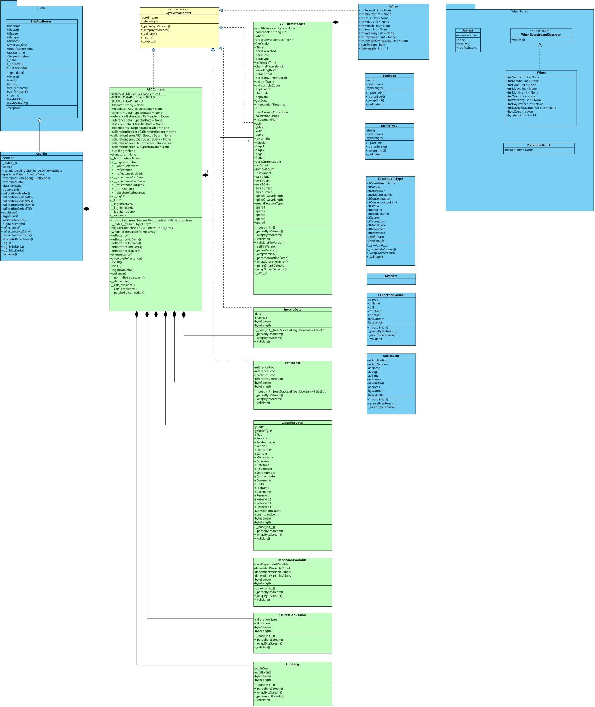

# Developer Guide

This page is the developer-facing entry point for `pyASDReader`. It gives a
short overview of the source layout, the parser design, and the checks to run
when changing the project. The complete contribution workflow is documented in
[`CONTRIBUTING.md`](https://github.com/KaiTastic/pyASDReader/blob/main/CONTRIBUTING.md).

## Development setup

The project supports Python 3.8 and newer. From the repository root, create a
virtual environment and install the package with its development dependencies:

```bash
python -m venv .venv
source .venv/bin/activate
python -m pip install --upgrade pip
python -m pip install -e ".[dev]"
```

Run the test suite to confirm that the environment can read the checked-in ASD
fixtures:

```bash
python -m pytest tests/
```

## Source layout

The repository is intentionally small, so changes usually belong in one of
these locations:

| Location | Responsibility |
| --- | --- |
| `src/asd_file_reader.py` | Public `ASDFile` API and binary parsing flow |
| `src/file_attributes.py` | Shared file metadata and content attributes |
| `src/constant.py` | ASD enumerations and format constants |
| `src/logger_setup.py` | Package logging configuration |
| `tests/` | Parser behavior, metadata, and fixture-based regression tests |
| `docs/` | User, developer, and release documentation |

Keep format-specific parsing in `ASDFile`, reusable file metadata in
`FileAttributes`, and symbolic format values in `constant.py`. Avoid exposing
byte offsets or other implementation details as part of the public API unless
the format requires them.

## Core class design

The class diagram below shows the main relationships in `pyASDReader`.

## Core classes

`ASDFile` is the main public class for reading ASD binary files. It inherits
from `FileAttributes`, which provides general file information such as the
file path, size, timestamps, permissions, and content hashes. The ASD-specific
parser is responsible for decoding the binary stream and exposing the decoded
sections as attributes on the `ASDFile` instance.

The format-specific values used during parsing are defined in `constant.py`.
These enums represent file versions, instrument types, spectrum and data
formats, calibration series, integration times, and signature or audit states.

## Parsing flow

When a file path is passed to `ASDFile`, the file is loaded automatically. The
`read()` method then parses the stream in the order defined by the ASD file
format:

1. File version and metadata header.
2. Wavelengths and primary spectrum data.
3. Reference file header and reference data for version 2 and later.
4. Classifier data and dependent variables for version 6 and later.
5. Calibration header and calibration series for version 7 and later.
6. Audit log and digital signature for version 8 and later.

Each section is parsed using the current byte offset. The parser advances the
offset after successfully decoding a section, so later sections can be read
without reinterpreting earlier bytes. The `wavelengths` array is derived from
the metadata channel count, first wavelength, and wavelength step.

## Version compatibility

The version checks in `read()` are intentional: older ASD files do not contain
the sections introduced by later format versions. Consumers should therefore
check whether an optional attribute is `None` before using it, especially for
classifier, calibration, audit-log, and signature data.

## Making parser changes

When adding support for a field or a newer ASD format version:

1. Identify the field's position and encoding in the ASD format specification.
2. Add or update the corresponding constant or model attribute.
3. Advance the parser offset only after the field has been decoded.
4. Guard version-specific sections with the version in which they were introduced.
5. Add a regression test using the smallest representative fixture available.
6. Preserve the behavior of older file versions, including `None` for absent
	optional sections.

For binary parsing, prefer explicit little-endian decoding and existing helper
patterns in `src/asd_file_reader.py`. Do not silently reinterpret truncated or
malformed data as valid metadata.

## Tests and checks

Use the narrowest check that matches the change, then run the complete suite:

```bash
# Parser behavior
python -m pytest tests/test_asd_file_reader.py

# File metadata behavior
python -m pytest tests/test_file_attributes.py

# Formatting and linting
black --check src/ tests/
isort --check-only src/ tests/
flake8 src/ tests/

# All configured pre-commit hooks
pre-commit run --all-files

# Full test suite with coverage
python -m pytest tests/ --cov=pyASDReader --cov-report=html
```

Tests should use the fixtures under `tests/sample_data/` and should describe
the file version or behavior they protect. Do not add proprietary ASD files to
the repository; redact or synthesize data when a new fixture is necessary.

## Documentation changes

Update this page for architecture or contributor workflow changes. Update the
user-facing documentation in `README.md` or `docs/index.md` when a public API,
supported file version, or user-visible behavior changes. Build the Sphinx
documentation locally when changing links, headings, or diagrams:

```bash
python -m pip install -e ".[docs]"
python -m sphinx -W -b html docs docs/_build/html
```

## Visual Paradigm source files

 The editable class-design source is maintained as a <a href="https://www.visual-paradigm.com/"></a> project:

- `Core_Class_Design.vpp` is the primary project file. Open it with Visual Paradigm to inspect or update the class diagram and its model elements.

   [Download the .vpp version](architecture/class_design/Core_Class_Design.vpp).



- Also provieded in the PDF format:

  [Download the PDF version](architecture/class_diagram/Core_Class_Design.pdf).

